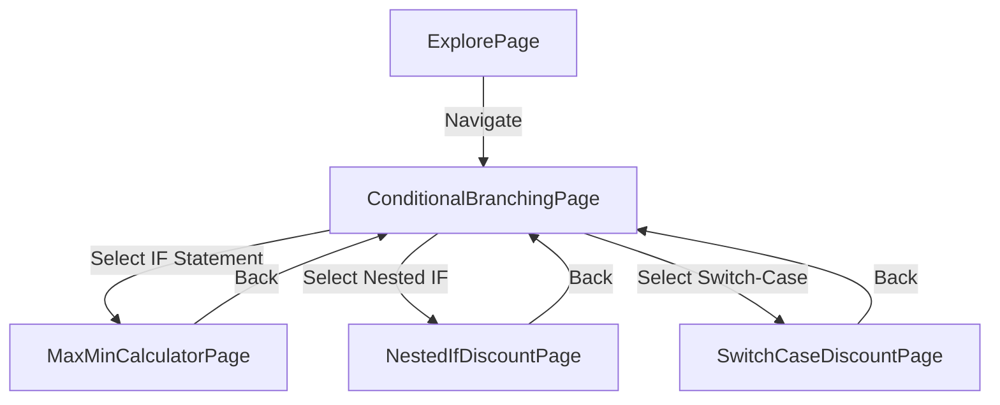

# Design Document: Conditional Branching Exercises

## Overview

The Conditional Branching Exercises feature is an educational module within the Flutter application that teaches users about conditional branching through three interactive exercises. The module demonstrates IF statements, Nested IF, and Switch-Case constructs through practical calculation scenarios.

### Design Goals

1. **Educational Clarity**: Each exercise clearly demonstrates a specific conditional branching concept
2. **Consistency**: Maintain visual and interaction patterns consistent with existing features (GeometryCalculator, ExplorePage)
3. **Reusability**: Create modular components that can be extended for future educational exercises
4. **User Experience**: Provide immediate feedback, clear error messages, and intuitive navigation

### Key Design Decisions

- **Architecture Pattern**: Follow the existing pattern of a main selection page (similar to ExplorePage) with individual exercise pages
- **State Management**: Use StatefulWidget with local state management (consistent with GeometryCalculator)
- **Validation Strategy**: Implement inline validation with immediate feedback
- **Navigation**: Use standard Flutter Navigator for page transitions
- **Styling**: Adopt a consistent color scheme and gradient patterns matching the existing app design

## Architecture

### Component Hierarchy

```
ConditionalBranchingPage (Main Selection)
├── MaxMinCalculatorPage (IF Statement Exercise)
├── NestedIfDiscountPage (Nested IF Exercise)
└── SwitchCaseDiscountPage (Switch-Case Exercise)
```

### File Structure

```
lib/pages/conditional_branching/
├── conditional_branching_page.dart      # Main selection page
├── max_min_calculator_page.dart         # IF statement exercise
├── nested_if_discount_page.dart         # Nested IF exercise
├── switch_case_discount_page.dart       # Switch-Case exercise
└── widgets/
    ├── exercise_card.dart               # Reusable card for exercise selection
    ├── calculator_input_field.dart      # Reusable input field with validation
    ├── result_display_card.dart         # Reusable result display component
    └── discount_result_card.dart        # Specialized result card for discount calculations
```

### Navigation Flow



## Components and Interfaces

### 1. ConditionalBranchingPage

**Purpose**: Main selection page that displays all three exercises and handles navigation.

**State**: Stateless widget (no local state needed)

**Key Properties**:
- List of exercise configurations (title, description, icon, color, target page)

**Methods**:
- `build(BuildContext context)`: Renders the exercise selection UI

**UI Elements**:
- AppBar with gradient background
- ListView of ExerciseCard widgets
- Each card navigates to its respective exercise page

### 2. MaxMinCalculatorPage

**Purpose**: Demonstrates IF statement usage by comparing two numbers.

**State**: Stateful widget

**State Variables**:
```dart
TextEditingController _number1Controller
TextEditingController _number2Controller
double? _maxValue
double? _minValue
bool _isEqual
bool _isCalculated
String? _errorMessage
```

**Methods**:
- `_validateInputs()`: Validates that both inputs are numeric
- `_calculate()`: Performs max/min comparison using IF statements
- `_reset()`: Clears all inputs and results
- `_showError(String message)`: Displays error message

**Calculation Logic**:
```dart
void _calculate() {
  double num1 = double.parse(_number1Controller.text);
  double num2 = double.parse(_number2Controller.text);
  
  if (num1 > num2) {
    _maxValue = num1;
    _minValue = num2;
    _isEqual = false;
  } else if (num2 > num1) {
    _maxValue = num2;
    _minValue = num1;
    _isEqual = false;
  } else {
    _isEqual = true;
  }
  
  _isCalculated = true;
}
```

### 3. NestedIfDiscountPage

**Purpose**: Demonstrates Nested IF by calculating tiered discounts.

**State**: Stateful widget

**State Variables**:
```dart
TextEditingController _purchaseAmountController
double? _originalAmount
double? _discountRate
double? _discountAmount
double? _finalPayment
bool _isCalculated
String? _errorMessage
```

**Methods**:
- `_validateInput()`: Validates positive numeric input
- `_calculateDiscount()`: Calculates discount using nested IF logic
- `_reset()`: Clears all inputs and results
- `_formatCurrency(double value)`: Formats numbers as Rupiah

**Calculation Logic**:
```dart
void _calculateDiscount() {
  double amount = double.parse(_purchaseAmountController.text);
  double rate = 0;
  
  if (amount >= 1500000) {
    rate = 0.30;
  } else {
    if (amount >= 1000000) {
      rate = 0.20;
    } else {
      if (amount >= 500000) {
        rate = 0.10;
      } else {
        rate = 0.0;
      }
    }
  }
  
  _discountRate = rate;
  _discountAmount = amount * rate;
  _finalPayment = amount - _discountAmount!;
  _originalAmount = amount;
  _isCalculated = true;
}
```

### 4. SwitchCaseDiscountPage

**Purpose**: Demonstrates Switch-Case by calculating the same tiered discounts.

**State**: Stateful widget (identical state to NestedIfDiscountPage)

**State Variables**: Same as NestedIfDiscountPage

**Methods**:
- `_validateInput()`: Validates positive numeric input
- `_calculateDiscount()`: Calculates discount using switch-case logic
- `_getTier(double amount)`: Determines discount tier from amount
- `_reset()`: Clears all inputs and results
- `_formatCurrency(double value)`: Formats numbers as Rupiah

**Calculation Logic**:
```dart
int _getTier(double amount) {
  if (amount >= 1500000) return 4;
  if (amount >= 1000000) return 3;
  if (amount >= 500000) return 2;
  return 1;
}

void _calculateDiscount() {
  double amount = double.parse(_purchaseAmountController.text);
  double rate = 0;
  int tier = _getTier(amount);
  
  switch (tier) {
    case 4:
      rate = 0.30;
      break;
    case 3:
      rate = 0.20;
      break;
    case 2:
      rate = 0.10;
      break;
    case 1:
    default:
      rate = 0.0;
      break;
  }
  
  _discountRate = rate;
  _discountAmount = amount * rate;
  _finalPayment = amount - _discountAmount!;
  _originalAmount = amount;
  _isCalculated = true;
}
```

### 5. Reusable Widget Components

#### ExerciseCard

**Purpose**: Reusable card component for exercise selection.

**Properties**:
```dart
final String title
final String description
final IconData icon
final Color color
final VoidCallback onTap
```

**UI**: Card with gradient background, icon, title, description, and arrow indicator.

#### CalculatorInputField

**Purpose**: Reusable text field with built-in validation styling.

**Properties**:
```dart
final TextEditingController controller
final String label
final String hint
final String? errorText
final TextInputType keyboardType
final ValueChanged<String>? onChanged
```

**Features**:
- Automatic error state styling
- Consistent border radius and padding
- Icon prefix support

#### ResultDisplayCard

**Purpose**: Displays calculation results for max/min calculator.

**Properties**:
```dart
final double? maxValue
final double? minValue
final bool isEqual
```

**UI**: White card with shadow, displays max/min values or equality message.

#### DiscountResultCard

**Purpose**: Displays discount calculation results.

**Properties**:
```dart
final double originalAmount
final double discountRate
final double discountAmount
final double finalPayment
```

**UI**: White card with shadow, displays all discount calculation details with proper formatting.

## Data Models

### ExerciseConfig

```dart
class ExerciseConfig {
  final String title;
  final String description;
  final IconData icon;
  final Color color;
  final Widget page;
  
  const ExerciseConfig({
    required this.title,
    required this.description,
    required this.icon,
    required this.color,
    required this.page,
  });
}
```

### DiscountTier

```dart
enum DiscountTier {
  tier1, // < 500000, 0%
  tier2, // 500000-999999, 10%
  tier3, // 1000000-1499999, 20%
  tier4, // >= 1500000, 30%
}

extension DiscountTierExtension on DiscountTier {
  double get rate {
    switch (this) {
      case DiscountTier.tier1:
        return 0.0;
      case DiscountTier.tier2:
        return 0.10;
      case DiscountTier.tier3:
        return 0.20;
      case DiscountTier.tier4:
        return 0.30;
    }
  }
  
  double get minAmount {
    switch (this) {
      case DiscountTier.tier1:
        return 0;
      case DiscountTier.tier2:
        return 500000;
      case DiscountTier.tier3:
        return 1000000;
      case DiscountTier.tier4:
        return 1500000;
    }
  }
}
```

### ValidationResult

```dart
class ValidationResult {
  final bool isValid;
  final String? errorMessage;
  
  const ValidationResult({
    required this.isValid,
    this.errorMessage,
  });
  
  factory ValidationResult.valid() => const ValidationResult(isValid: true);
  
  factory ValidationResult.invalid(String message) => 
    ValidationResult(isValid: false, errorMessage: message);
}
```

## Correctness Properties

*A property is a characteristic or behavior that should hold true across all valid executions of a system—essentially, a formal statement about what the system should do. Properties serve as the bridge between human-readable specifications and machine-verifiable correctness guarantees.*

### Property 1: Max-Min Comparison Correctness

*For any* two numeric values num1 and num2, when compared by the Max_Min_Calculator, the identified maximum SHALL be greater than or equal to the minimum, and both values SHALL be present in the original input set.

**Validates: Requirements 1.2, 1.3, 1.4**

### Property 2: Max-Min Equality Handling

*For any* two numeric values num1 and num2 where num1 equals num2, the Max_Min_Calculator SHALL identify them as equal and SHALL NOT designate either as maximum or minimum.

**Validates: Requirements 1.5**

### Property 3: Discount Tier Boundary Consistency

*For any* purchase amount that falls exactly on a tier boundary (500000, 1000000, or 1500000), both Discount_Calculator_Nested and Discount_Calculator_Switch SHALL apply the higher tier discount rate.

**Validates: Requirements 2.2, 2.3, 2.4, 3.3, 3.4, 3.5, 6.4**

### Property 4: Discount Calculation Accuracy

*For any* valid purchase amount and its corresponding discount rate, the calculated discount amount SHALL equal the purchase amount multiplied by the discount rate, and the final payment SHALL equal the purchase amount minus the discount amount.

**Validates: Requirements 2.6, 2.7, 3.7, 3.8**

### Property 5: Nested IF and Switch-Case Equivalence

*For any* valid purchase amount, the Discount_Calculator_Nested and Discount_Calculator_Switch SHALL produce identical discount rates, discount amounts, and final payment values.

**Validates: Requirements 3.14, 6.7**

### Property 6: Input Validation Consistency

*For any* empty, non-numeric, or invalid input, the Input_Validator SHALL prevent calculation execution and display an appropriate error message before any calculation logic is executed.

**Validates: Requirements 5.1, 5.2, 5.5**

### Property 7: Negative Value Handling

*For any* negative numeric value, the Max_Min_Calculator SHALL accept it as valid input, while the discount calculators SHALL reject it with an error message.

**Validates: Requirements 5.3, 5.4**

### Property 8: Currency Formatting Consistency

*For any* calculated currency value, the Result_Display SHALL format it with "Rp" prefix, thousand separators, and round to the nearest Rupiah (no decimal places).

**Validates: Requirements 4.4, 6.8**

### Property 9: Percentage Formatting Consistency

*For any* discount rate value, the Result_Display SHALL format it as a percentage with "%" suffix and display it with appropriate precision.

**Validates: Requirements 4.5**

### Property 10: Calculation Precision

*For any* numeric input with decimal places, all intermediate calculations SHALL maintain precision up to 2 decimal places, and final currency displays SHALL round to the nearest whole number.

**Validates: Requirements 6.1, 6.2, 6.3**

## Error Handling

### Input Validation Errors

**Empty Input Error**:
- **Trigger**: User submits form with empty fields
- **Message**: "Semua field harus diisi"
- **Action**: Highlight empty fields, prevent calculation

**Non-Numeric Input Error**:
- **Trigger**: User enters non-numeric characters
- **Message**: "Input harus berupa angka"
- **Action**: Highlight invalid field, prevent calculation

**Negative/Zero Amount Error** (Discount Calculators Only):
- **Trigger**: User enters negative or zero value
- **Message**: "Jumlah pembelian harus lebih dari 0"
- **Action**: Highlight field, prevent calculation

### Parsing Errors

**Number Format Exception**:
- **Trigger**: `double.parse()` fails
- **Handling**: Catch exception, display "Format angka tidak valid"
- **Recovery**: Clear invalid input, allow user to re-enter

### State Management Errors

**Null State Access**:
- **Prevention**: Use null-safety operators (`?`, `??`, `!`) appropriately
- **Handling**: Check `_isCalculated` flag before accessing result variables
- **Recovery**: Reset to initial state if inconsistency detected

### Navigation Errors

**Page Not Found**:
- **Prevention**: Use const constructors for all page widgets
- **Handling**: Should not occur with proper implementation
- **Recovery**: Log error, return to previous page

## Testing Strategy

### Unit Testing

**Input Validation Tests**:
- Test empty input detection
- Test non-numeric input detection
- Test negative value handling (different for max/min vs discount)
- Test zero value handling
- Test decimal number handling
- Test very large numbers
- Test boundary values (500000, 1000000, 1500000)

**Calculation Logic Tests**:
- Test max/min comparison with num1 > num2
- Test max/min comparison with num2 > num1
- Test max/min comparison with num1 == num2
- Test discount calculation for each tier
- Test discount calculation at tier boundaries
- Test nested IF produces correct rates
- Test switch-case produces correct rates
- Test nested IF and switch-case equivalence

**Formatting Tests**:
- Test currency formatting with various amounts
- Test percentage formatting
- Test thousand separator insertion
- Test rounding behavior

**Widget Tests**:
- Test ExerciseCard tap behavior
- Test CalculatorInputField validation display
- Test ResultDisplayCard rendering
- Test DiscountResultCard rendering
- Test navigation between pages
- Test reset button functionality

### Property-Based Testing

The property-based tests will use the `test` package with custom generators for comprehensive input coverage. Each test will run a minimum of 100 iterations.

**Test Framework**: Dart `test` package with custom property-based testing utilities

**Property Test 1: Max-Min Comparison Correctness**
```dart
// Feature: conditional-branching-exercises, Property 1: Max-Min Comparison Correctness
test('max-min comparison correctness', () {
  for (int i = 0; i < 100; i++) {
    double num1 = randomDouble();
    double num2 = randomDouble();
    var result = calculateMaxMin(num1, num2);
    expect(result.max >= result.min, true);
    expect([num1, num2].contains(result.max), true);
    expect([num1, num2].contains(result.min), true);
  }
});
```

**Property Test 2: Max-Min Equality Handling**
```dart
// Feature: conditional-branching-exercises, Property 2: Max-Min Equality Handling
test('max-min equality handling', () {
  for (int i = 0; i < 100; i++) {
    double num = randomDouble();
    var result = calculateMaxMin(num, num);
    expect(result.isEqual, true);
    expect(result.max, null);
    expect(result.min, null);
  }
});
```

**Property Test 3: Discount Tier Boundary Consistency**
```dart
// Feature: conditional-branching-exercises, Property 3: Discount Tier Boundary Consistency
test('discount tier boundary consistency', () {
  List<double> boundaries = [500000, 1000000, 1500000];
  for (double boundary in boundaries) {
    var nestedResult = calculateDiscountNested(boundary);
    var switchResult = calculateDiscountSwitch(boundary);
    expect(nestedResult.rate, switchResult.rate);
    // Verify higher tier is applied
    var lowerResult = calculateDiscountNested(boundary - 1);
    expect(nestedResult.rate > lowerResult.rate, true);
  }
});
```

**Property Test 4: Discount Calculation Accuracy**
```dart
// Feature: conditional-branching-exercises, Property 4: Discount Calculation Accuracy
test('discount calculation accuracy', () {
  for (int i = 0; i < 100; i++) {
    double amount = randomPositiveDouble();
    var result = calculateDiscountNested(amount);
    double expectedDiscount = amount * result.rate;
    double expectedFinal = amount - expectedDiscount;
    expect((result.discountAmount - expectedDiscount).abs() < 0.01, true);
    expect((result.finalPayment - expectedFinal).abs() < 0.01, true);
  }
});
```

**Property Test 5: Nested IF and Switch-Case Equivalence**
```dart
// Feature: conditional-branching-exercises, Property 5: Nested IF and Switch-Case Equivalence
test('nested IF and switch-case equivalence', () {
  for (int i = 0; i < 100; i++) {
    double amount = randomPositiveDouble();
    var nestedResult = calculateDiscountNested(amount);
    var switchResult = calculateDiscountSwitch(amount);
    expect(nestedResult.rate, switchResult.rate);
    expect(nestedResult.discountAmount, switchResult.discountAmount);
    expect(nestedResult.finalPayment, switchResult.finalPayment);
  }
});
```

**Property Test 6: Input Validation Consistency**
```dart
// Feature: conditional-branching-exercises, Property 6: Input Validation Consistency
test('input validation consistency', () {
  List<String> invalidInputs = ['', 'abc', '12.34.56', 'null'];
  for (String input in invalidInputs) {
    var result = validateInput(input);
    expect(result.isValid, false);
    expect(result.errorMessage, isNotNull);
  }
});
```

**Property Test 7: Negative Value Handling**
```dart
// Feature: conditional-branching-exercises, Property 7: Negative Value Handling
test('negative value handling', () {
  for (int i = 0; i < 100; i++) {
    double negativeNum = -randomPositiveDouble();
    // Max-min should accept
    var maxMinResult = validateMaxMinInput(negativeNum.toString());
    expect(maxMinResult.isValid, true);
    // Discount should reject
    var discountResult = validateDiscountInput(negativeNum.toString());
    expect(discountResult.isValid, false);
  }
});
```

**Property Test 8: Currency Formatting Consistency**
```dart
// Feature: conditional-branching-exercises, Property 8: Currency Formatting Consistency
test('currency formatting consistency', () {
  for (int i = 0; i < 100; i++) {
    double amount = randomPositiveDouble();
    String formatted = formatCurrency(amount);
    expect(formatted.startsWith('Rp'), true);
    expect(formatted.contains('.'), false); // No decimals
    if (amount >= 1000) {
      expect(formatted.contains('.'), true); // Thousand separator
    }
  }
});
```

**Property Test 9: Percentage Formatting Consistency**
```dart
// Feature: conditional-branching-exercises, Property 9: Percentage Formatting Consistency
test('percentage formatting consistency', () {
  List<double> rates = [0.0, 0.10, 0.20, 0.30];
  for (double rate in rates) {
    String formatted = formatPercentage(rate);
    expect(formatted.endsWith('%'), true);
    double parsed = double.parse(formatted.replaceAll('%', ''));
    expect((parsed - rate * 100).abs() < 0.01, true);
  }
});
```

**Property Test 10: Calculation Precision**
```dart
// Feature: conditional-branching-exercises, Property 10: Calculation Precision
test('calculation precision', () {
  for (int i = 0; i < 100; i++) {
    double amount = randomDoubleWithDecimals();
    var result = calculateDiscountNested(amount);
    // Intermediate calculations maintain 2 decimal precision
    String discountStr = result.discountAmount.toStringAsFixed(2);
    expect(discountStr.split('.')[1].length, 2);
    // Final display rounds to whole number
    String finalStr = formatCurrency(result.finalPayment);
    expect(finalStr.contains(','), false); // No decimal separator
  }
});
```

### Integration Testing

**Navigation Flow Tests**:
- Test navigation from ExplorePage to ConditionalBranchingPage
- Test navigation from ConditionalBranchingPage to each exercise
- Test back navigation from exercises to selection page
- Test app bar back button functionality

**End-to-End Calculation Tests**:
- Test complete flow: input → validate → calculate → display
- Test reset functionality clears all state
- Test multiple calculations in sequence
- Test switching between exercises maintains independent state

**UI Interaction Tests**:
- Test keyboard input handling
- Test button press responses
- Test error message display and clearing
- Test result card appearance after calculation

### Manual Testing Checklist

- [ ] Visual consistency with existing app design
- [ ] Smooth animations and transitions
- [ ] Proper keyboard handling (dismiss on tap outside)
- [ ] Error messages are clear and helpful
- [ ] Results are easy to read and understand
- [ ] App doesn't crash with extreme inputs
- [ ] Performance is smooth on target devices
- [ ] Accessibility: screen reader compatibility
- [ ] Accessibility: sufficient color contrast
- [ ] Accessibility: touch target sizes

## Implementation Notes

### Color Scheme

Following the existing app patterns:
- **Primary Color**: `Color(0xFF1565C0)` (Blue)
- **Secondary Color**: `Color(0xFF7B1FA2)` (Purple)
- **Accent Color**: `Color(0xFFFF6F00)` (Orange) - for conditional branching feature
- **Background Gradient**: Light gray to light blue
- **Success Color**: `Color(0xFF2E7D32)` (Green)
- **Error Color**: `Color(0xFFD32F2F)` (Red)

### Typography

- **Title**: 24px, Bold
- **Subtitle**: 18px, SemiBold
- **Body**: 16px, Regular
- **Caption**: 14px, Regular
- **Result Value**: 32px, Bold

### Spacing

- **Card Padding**: 20px
- **Section Spacing**: 24px
- **Element Spacing**: 16px
- **Small Spacing**: 8px

### Border Radius

- **Cards**: 16px
- **Buttons**: 12px
- **Input Fields**: 12px

### Utility Functions

```dart
// Currency formatting
String formatCurrency(double value) {
  final formatter = NumberFormat.currency(
    locale: 'id_ID',
    symbol: 'Rp',
    decimalDigits: 0,
  );
  return formatter.format(value);
}

// Percentage formatting
String formatPercentage(double rate) {
  return '${(rate * 100).toStringAsFixed(0)}%';
}

// Input validation
ValidationResult validateNumericInput(String input, {bool allowNegative = true}) {
  if (input.trim().isEmpty) {
    return ValidationResult.invalid('Field tidak boleh kosong');
  }
  
  final number = double.tryParse(input);
  if (number == null) {
    return ValidationResult.invalid('Input harus berupa angka');
  }
  
  if (!allowNegative && number <= 0) {
    return ValidationResult.invalid('Nilai harus lebih dari 0');
  }
  
  return ValidationResult.valid();
}
```

### Performance Considerations

- Use `const` constructors wherever possible
- Avoid rebuilding entire widget tree on state changes
- Use `TextField` controllers efficiently (dispose in `dispose()` method)
- Cache formatted strings when values don't change
- Use `ListView.builder` for exercise list (though only 3 items, good practice)

### Accessibility

- Provide semantic labels for all interactive elements
- Ensure sufficient color contrast (WCAG AA minimum)
- Support screen readers with proper widget semantics
- Minimum touch target size: 48x48 logical pixels
- Support text scaling (test with large text sizes)

### Localization Preparation

While not implementing full localization now, structure strings for easy extraction:
- Keep all user-facing strings as constants
- Use descriptive constant names
- Group related strings together
- Avoid string concatenation for sentences

```dart
class ConditionalBranchingStrings {
  static const String pageTitle = 'Latihan Percabangan';
  static const String ifStatementTitle = 'IF Statement';
  static const String nestedIfTitle = 'Nested IF';
  static const String switchCaseTitle = 'Switch-Case';
  // ... more strings
}
```
